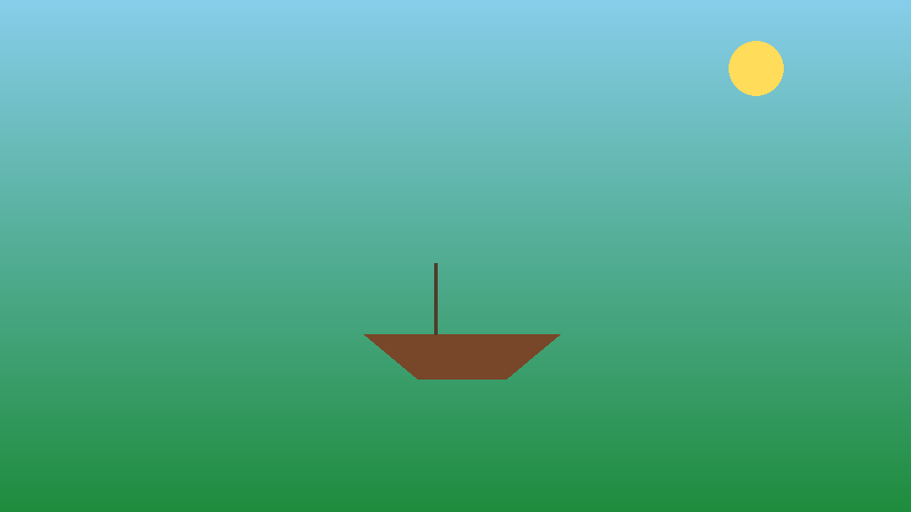

# comfyui-i2v-tools

[ComfyUI](https://github.com/comfyanonymous/ComfyUI) + [LTX-Video](https://github.com/Lightricks/LTX-Video) / [Stable Video Diffusion (SVD-XT)](https://huggingface.co/stabilityai/stable-video-diffusion-img2vid-xt) を使い、画像を条件にした動画生成をローカルGPUで行うための補助スクリプト集。基本的なimg2video生成そのものは手元のClaude Codeスキル `image-to-video`(単一画像→動画の基本ワークフロー)に任せ、本リポジトリはそこに含まれない発展的な手法(長尺のマルチキーフレーム誘導、人物等を保護したままのimg2img)をまとめたもの。

| 合成テスト画像(`test_image.png`) | 保護マスク(`protect_mask_sample.png`) |
| --- | --- |
|  |  |

*どちらも`make_test_image.py`/`make_protect_mask.py`が描画した完全な合成画像(実在の人物・作品とは無関係)。マスク保護img2imgでは、白領域だけがプロンプトに従って変化し、黒領域(被写体)は元画像のまま保たれる。*

## 動作環境

- NVIDIA GPU (CUDA)、VRAM 11GB以上を推奨(GTX 1080 Ti で動作確認)
- Python 3.11
- [ComfyUI](https://github.com/comfyanonymous/ComfyUI) が起動済みで、以下のモデルが導入済みであること
  - LTX-Video 2B (`ltx-video-2b-v0.9.5.safetensors`) + T5テキストエンコーダ (`t5xxl_fp8_e4m3fn_scaled.safetensors`)
  - 任意のSD1.5系チェックポイント(`generate_masked_variant.py`用。Realistic Vision, Anything V5等で動作確認)

本リポジトリのスクリプトはComfyUIのHTTP API(`/prompt`, `/history`)を叩くクライアントであり、ComfyUI自体やモデルの導入は別途必要。

## セットアップ

```bash
python -m venv .venv
source .venv/bin/activate   # Windows は .venv\Scripts\activate
pip install -r requirements.txt
```

## 使い方

### 1. 合成テスト画像の生成

実在の人物を含まない、完全に合成のテスト画像を作る。動作確認用のサンプルとして使う。

```bash
cd scripts
python make_test_image.py --out ../data/test_image.png
```

### 2. マスク保護img2img(`generate_masked_variant.py`)

画像の一部(被写体など)を一切変えず、それ以外だけをプロンプトに従って変化させた新しい画像を作る。長尺動画のマルチキーフレーム誘導で使う中間状態の画像を、被写体の品質を落とさずに増やす用途を想定。

保護は二重に行う: (1) `VAEEncodeForInpaint`のnoise_maskで拡散過程自体をマスク領域に効かせにくくし、(2) 生成後に`ImageCompositeMasked`で保護領域のピクセルを元画像に完全に戻す。

```bash
# 保護したい領域(白=変化させる, 黒=保護)のマスクを作る
python make_protect_mask.py --width 1024 --height 576 \
    --protect-ellipse 380,300,660,480 \
    --out ../data/protect_mask.png

# マスクを保護しつつ、それ以外をプロンプトで変化させる
python generate_masked_variant.py \
    --image ../data/test_image.png \
    --mask ../data/protect_mask.png \
    --prompt "dramatic stormy sky, dark clouds, rain" \
    --checkpoint Realistic_Vision_V5.1_fp16-no-ema.safetensors \
    --denoise 0.8 \
    --out-dir ../data/out
```

### 3. マルチキーフレーム誘導による長尺動画生成(`generate_multikeyframe.py`)

複数の画像を「動画内の特定フレーム位置」に誘導点として紐づけ、1回の連続した拡散生成で長め(数秒〜十数秒)の動画を作る。前後で独立に短い動画を作ってffmpegで繋ぐ方式より、モデルが全体の文脈を1回で見ながらノイズ除去するため、継ぎ目の破綻が少なくなりやすい。

```bash
python generate_multikeyframe.py \
    --start-image ../data/test_image.png \
    --guide "../data/out/masked_variant_00001_.png:96:1.0" \
    --guide "../data/test_image.png:-1:1.0" \
    --prompt "long descriptive text covering the whole story, best quality, 4k, cinematic" \
    --length 193 --width 1024 --height 576 \
    --out-dir ../data/out
```

`--guide` は `画像パス:フレーム位置:強度` の形式で複数回指定できる。フレーム位置は基本的に8の倍数を推奨、`-1`は最終フレームを意味する。強度は0〜1で、1.0でその時点をほぼ完全にその画像へ固定する。

## 実測で得られた教訓

- **誘導画像の品質が動画全体の品質上限を決める。** `LTXVAddGuide`の`strength`をいくら上げても、誘導に使う画像自体が破綻していれば、その破綻がそのまま動画に焼き付けられる。誘導画像は生成後に必ず目視確認すること。
- **潜在空間のマスク(noise_mask)だけに頼らない。** `VAEEncodeForInpaint`のnoise_maskは完全な保護を保証しないケースがあったため、`ImageCompositeMasked`による画像空間での最終合成を必ず入れる方が確実。
- 長尺(8秒以上)の単一連続生成は、LTX-Video 2Bのような軽量モデルでは人物・顔の一貫性が崩れやすい。誘導点を密に(数秒おきに)入れることである程度緩和できる。

## 既知の注意点

- ComfyUIのワークフローはノードIDの衝突を避けるため`build_workflow`内で動的に生成している。ノード数が多い場合、ComfyUI側の処理時間が伸びる。
- `generate_masked_variant.py`のマスク座標は自動セグメンテーションではなく手動指定。対象画像ごとに調整が必要。
- Pascal世代GPU(GTX 10XX等)では`comfy_kitchen`の高速CUDAカーネルが無効化され、eagerバックエンドで動作する。最新GPUに比べ生成は低速。

## ライセンス

このリポジトリのコード自体に付属する追加のライセンス条件はない。使用するベースモデル(LTX-Video, Stable Video Diffusion, 各種SD1.5チェックポイント等)のライセンスについては各自で確認すること。同梱のサンプル画像(`data/test_image.png`)はPillowで描画した完全な合成画像であり、実在の人物・作品とは無関係。
